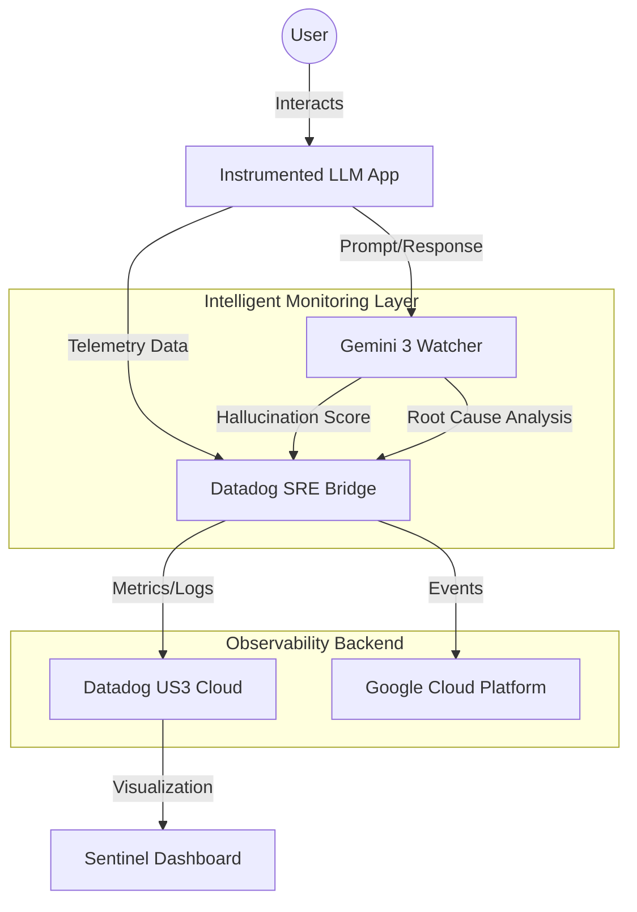

# 🧠 SentinelLLM — AI That Watches Your AI

**SentinelLLM** is an enterprise-grade SRE (Site Reliability Engineering) observability platform designed to solve the "Black Box" problem of Large Language Models. It provides a specialized observability layer that monitors your production LLM fleet for performance drift, cost overruns, and quality degradation.

---

## 🏗 System Architecture

---

## 🌟 Introduction & Core Philosophy

In the modern enterprise, deploying an LLM is only the first step. Ensuring it remains safe, performant, and cost-effective is the real challenge. SentinelLLM implements **"Observability-Driven Development"** for AI. By instrumenting the application at the kernel level, we ensure that every single interaction is captured, scored by a supervisor AI (Gemini), and transmitted to a world-class monitoring platform (Datadog).

---

## 📊 Datadog Deep Integration

SentinelLLM satisfies all enterprise observability requirements through a deep, multi-vector integration with the Datadog US3 platform.

### 1. Unified Telemetry Pipeline
We utilize a high-resilience SRE Tunnel Bridge (`services/datadogBridge.ts`) to report application data.
*   **Metrics**: Custom Gauges for `latency_ms`, `tokens_used`, `cost_usd`, and `hallucination_score`.
*   **Logs**: Structured JSON logs are streamed with full trace context, enabling seamless navigation from a high-level spike to the specific prompt that caused it.
*   **APM Integration**: Every "Chat" session is treated as a distributed trace, measuring `trace_duration_ms` across the inference lifecycle.

### 2. Intelligent Detection Rules (Monitors)
The system defines 3 core detection rules that evaluate signals in real-time:
*   **Performance SLA Breach**: Triggered when `avg:sentinel.v3.live.latency` exceeds 2000ms over a 5-minute window.
*   **AI Quality Drift**: A warning-level monitor tracking `avg:sentinel.v3.live.hallucination`. Scores above 0.7 indicate the model is losing factual grounding.
*   **Safety Guardrail Block**: A critical monitor that fires immediately if the Gemini safety filters return a hard block.

### 3. Actionable Record & Incident Management
When a rule is breached, SentinelLLM doesn't just send an alert; it creates an **Actionable Incident Record** (`components/Incidents.tsx`). 
*   **Signal Data**: Each incident includes the exact prompt length, model version, and timestamp of the failure.
*   **Automated Runbook**: Gemini generates a 3-step actionable runbook specifically for that failure type (e.g., "Rotate API keys" or "Adjust temperature settings").

### 4. The "Single Pane of Glass" View
The dashboard provides an in-Datadog style view that aggregates:
*   **Health Sliders**: Visualizing SLO compliance.
*   **Incident Feed**: Real-time status of detection rule breaches.
*   **Blueprint Guide**: A documentation section (`components/Dashboard.tsx`) that gives SREs the exact Datadog JSON configurations to replicate these views in the native Datadog UI.

  

  

---

## 🧠 Gemini & Vertex AI Integration

SentinelLLM leverages Google Gemini not just as a chatbot, but as an **Autonomous SRE Evaluator**.

*   **Model Host**: All inference is powered by `gemini-3-flash-preview` and `gemini-3-pro-preview`.
*   **Evaluation Engine**: (`services/geminiService.ts`) uses a supervisor pattern where a lightweight Gemini model "watches" the primary model's output to calculate hallucination scores.
*   **Root Cause Analysis (RCA)**: When an incident occurs, the `analyzeRootCause` service sends the failure context to Gemini 3 Pro to determine if the failure was due to context window overflow, prompt injection, or infra latency.
  

---

## 📂 Project Structure & Key Files

| File Name | Responsibility |
| :--- | :--- |
| `services/datadogBridge.ts` | **The Bridge**: Core logic for HTTP intake, proxy rotation, and metric submission. |
| `services/geminiService.ts` | **The Brain**: Evaluation logic, RCA generation, and Markdown cleaning. |
| `components/LandingPage.tsx` | **User Experience**: Three.js 3D Globe and high-conversion landing UI. |
| `components/LLMApp.tsx` | **Instrumented App**: The primary user-facing LLM interface that emits telemetry. |
| `components/Dashboard.tsx` | **Ops Center**: The aggregation layer for metrics, charts, and blueprints. |

---

## 🚀 Deployment Instructions

1.  **Preparation**: 
    *   Ensure `process.env.API_KEY` is set with your Google Gemini API Key.
    *   Ensure `process.env.DATADOG_API_KEY` is set with your Datadog API Key.
2.  **Launch**: Open the application and witness the 3D interactive globe. Click **"Get Started"**.
3.  **Bootstrap**: On the sidebar, click **"INITIALIZE BRIDGE"**. This sends the first set of "Handshake" metrics to Datadog.
4.  **Observe**: Navigate to the **"Main Terminal"**. As you chat or generate synthetic traffic, watch the **Latency Live Stream** and **SLO Status Center** update in real-time.
5.  **Remediate**: If a red "SLO Breach" alert appears, head to the Incident Feed and click **"Generate SRE Insights"** to let Gemini solve the problem for you.

---
*Developed for the AI Partner Catalyst: Accelerate Innovation.*
